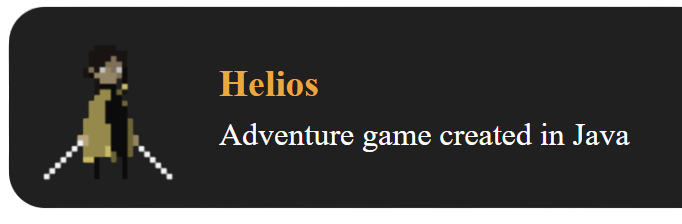

# 👋 Kurucz Attila vagyok!

🎓 Jelenleg a Budapesti Műszaki és Gazdaságtudományi Egyetem Villamosmérnöki és Informatikai Karán tanulok mérnökinformatikus szakon, a 6. félévemet végzem.

💻 Szenvedélyem a szoftverfejlesztés, különös érdeklődést mutatok a játékszoftverek és az IT biztonság iránt.

## 🛠️ Technológiák és eszközök

- **Programozási nyelvek:** C, C++, Java, Python
- **Keretek és könyvtárak:** PyTorch

## 🚀 Aktuális projektek

- **Autonomous Grand Challenge 2025** – Egy autonóm járművek fejlesztését célzó kihívásban veszek részt.
- **CompTIA Security+** – Felkészülés a CompTIA Security+ tanúsítvány megszerzésére.

## 🎮 Hobbijaim

- Játékfejlesztés
- IT biztonság - Hackthebox
keresztül.

## 🧑‍💻 Projektjeim:

(Kattints a képre a megtekintéshez)

<a href="https://github.com/your-username/your-repo" target="_blank" style="text-decoration: none;">
  

    
    

      <h3 style="margin: 0; color: #0366d6;">Project Title</h3>
      
A brief description of your project.

    

  

</a>

